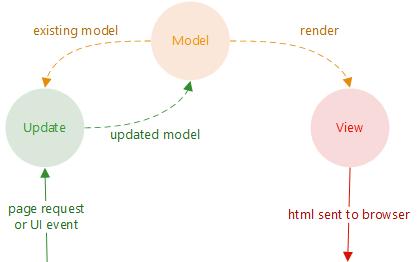
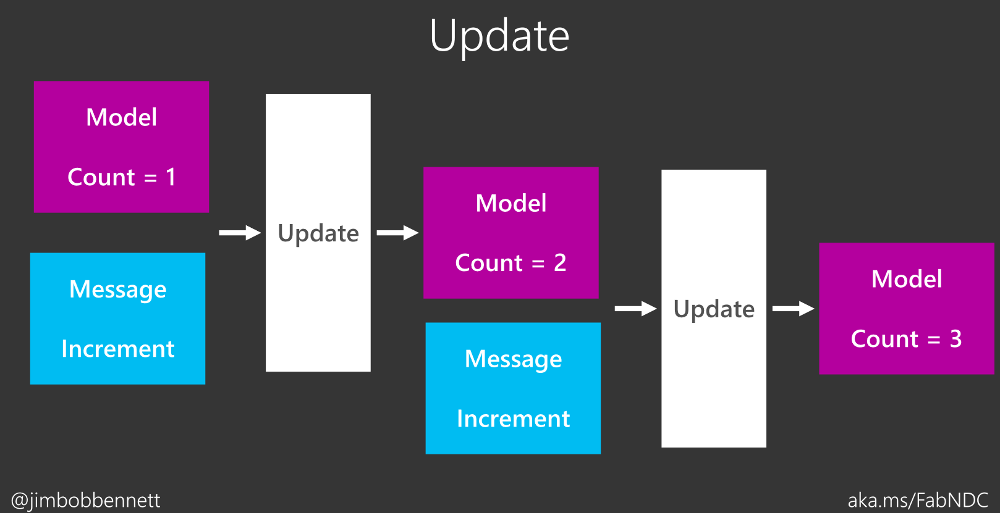

# Fabulous Tutorial

https://fsprojects.github.io/Fabulous
> MVU framework for working with Xamarin.Forms using F#

## MVU(Model, View, Update)

> an UI architecture first proposed in "Elm" front-end language
   
<a href="https://compositional-it.com/blog/2017/09-21-safe-elmish/index.html" target="_blank">https://compositional-it.com/blog/2017/09-21-safe-elmish/index.html</a>

### Express in a time line progress diagram:

(be sure to take a look of: <a href="http://aka.ms/FabNDC" target="_blank">http://aka.ms/FabNDC</a>)

## Advanges of MVU-arch (Fabulous as example):
1. Single direction data flow (single source of truth).
2. Model is immutable, so no problem for multi-thread access conditions.
3. Application code that update UI operate on *"Virtual UI"*, so it is testable & consume less time on actual UI thread, also capable of doing **"Live Update"**.
4. Model snapshots can be used as forward & backward *time-travel debugging*.